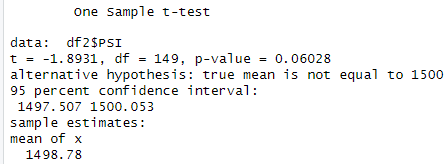
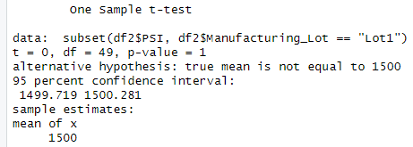
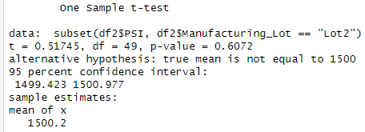
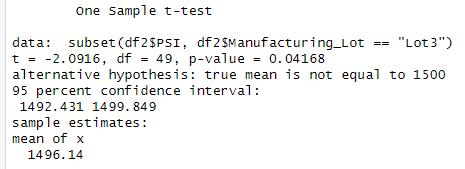

# Statistical_Analysis

## Part 1: Linear Regression to Predict MPG
For this project, the design specifications of 50 different experimental vehicles are examined to determine the impact of certain elements upon performance.  Given the data provided, a multivariable linear regression model was scripted such that each column heading in the dataset was computed as an individual variable potentially correlated with the dependant variable being predicted, Miles per Gallon (MPG).
```
lm1 <- lm(mpg ~ vehicle_length + vehicle_weight + spoiler_angle + ground_clearance + AWD, data=df1)
```
The results of this model were as seen below:


Assuming a significance threshold of 0.05, the coefficients produced by the model for vehicle length and ground clearance indicate a statistically significant, non-random variance.  The coefficients  for vehicle weight, spoiler angle, and all-wheel drive do not clear the threshold for statistical significance and can therefor be attributed to random variance.  

Additionally, the exceptionally small p-value of 5.35e-11 suggests the model displays a non-zero slope, invalidating the null hypothesis.

From these observations, it can be confidently asserted that this linear regression model posseses significant predictive power regarding the correlation between the variables included in the provided dataset and the MPG of the vehicles in question.  The Multiple R-squared value of 0.7149 indicates that the model is predictive of more than 71% of variations in MPG as explicated by the independent variables present, and the P-value is sufficiently low as to invalidate the null hypothesis.  All these qualities support a strongly predictive model.  

## Part 2:  Summary Statistics on Suspension Coils
The PSI measurements for suspension coils manufactured at various lots for the experimental vehicles being investigated by this project are provided.  Given this data, two tables were generated to summarize the statistical trends for the coils produced by each manufacturing lot, individually and collectively.

The suspension coil dataset was summarized as a whole by the following code:
```
total_summary <- df2 %>% summarize(Mean = mean(PSI), Median = median(PSI), Variance = var(PSI), SD = sd(PSI), .groups = 'keep')
```
This produced the following table:


The suspension coil dataset was summarized for individual manufacturing lots by the following code:
```
lot_summary <- df2 %>% group_by(Manufacturing_Lot) %>% summarize(Mean = mean(PSI), Median = median(PSI), Variance = var(PSI), SD = sd(PSI), .groups = 'keep')
```
This produced the following table:


The design specifications for the suspension coils prohibit their PSI measurements from exhibiting variance greater than 100 pounds per square inch.  Given this mandate, the three lots collectively pass quality assurance.  However, when considered individually, Lot 3 specifically fails while Lots 1 and 2 pass.      


## Part 3: T-Tests on Suspension Coils
Given a known population mean value of 1500 PSI for the model of suspension coil represented in the provided dataset, various t-tests were performed on the provided data to investigate the statistical deviation from this norm of the manufacturing lots in question, individually and as a whole.  

First, the three lots were tested as a whole using the following script:
```
t.test(df2$PSI, mu=1500)
```
This test produced the below results:


The p-value produced by this test is small enough that the null hypothesis can be rejected with 95% confidence, suggesting that the the mean PSI value for the coils across all manufacturing lots is significantly different from the known norm.

Next, three individual tests were performed, one for each individual manufacturing lot's data:

#### Lot 1
```
t.test(subset(df2$PSI, df2$Manufacturing_Lot == "Lot1"), mu=1500)
```


The p-value produced for Lot 1 is greater than 0.05 with 95% confidence, so the null hypothesis cannot be rejected.  This suggests that the mean PSI value for the coils produced by Lot 1 is not significantly different from tne known norm.

#### Lot 2
```
t.test(subset(df2$PSI, df2$Manufacturing_Lot == "Lot2"), mu=1500)
```


The p-value produced for Lot 2 is greater than 0.05 with 95% confidence, so the null hypothesis cannot be rejected.  This suggests that the mean PSI value for the coils produced by Lot 2 is not significantly different from tne known norm.

### Lot 3
```
t.test(subset(df2$PSI, df2$Manufacturing_Lot == "Lot3"), mu=1500)
```


The p-value produced for Lot 2 is less than 0.05 with 95% confidence, so the null hypothesis can in this case be rejected.  This suggests that the mean PSI value for the coils produced by Lot 2 is in fact significantly different from tne known norm.


## Part 4: Study Design
An additional possible statistical test is hereby proposed for the purpose of assesing the difference in performance between the experimental vehicles investigated thus far by this project and a sample of comparable competitor products.  Specifically; it is proposed that a two-way ANOVA (Analysis of Variance) test could be peformed to asses the relative performance of two vehicle populations in terms of the correlation between two factors, fuel efficiency and horse power, and a dependent variable, annual maintenace cost.  This approach would test three null hypotheses: that the mean annual maintenance costs are equal for varying values of fuel efficiency, that the mean annual maintenance costs are equal for varying values of horse power, and that there is no evidence of interaction between fuel efficiency and horse power.  The benefit of performing this particular test lies in its ability to simultaneously examine multiple possibly-correlated variables for interaction while investigating their impact on a common hypothesized dependency.      
